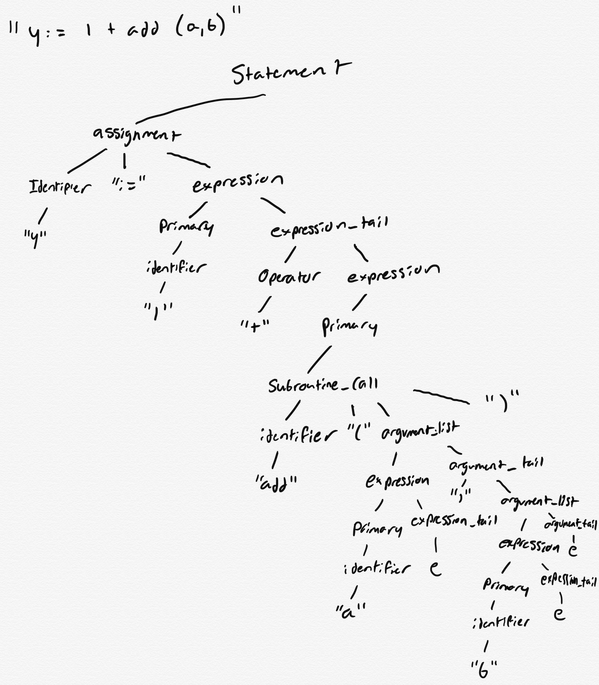
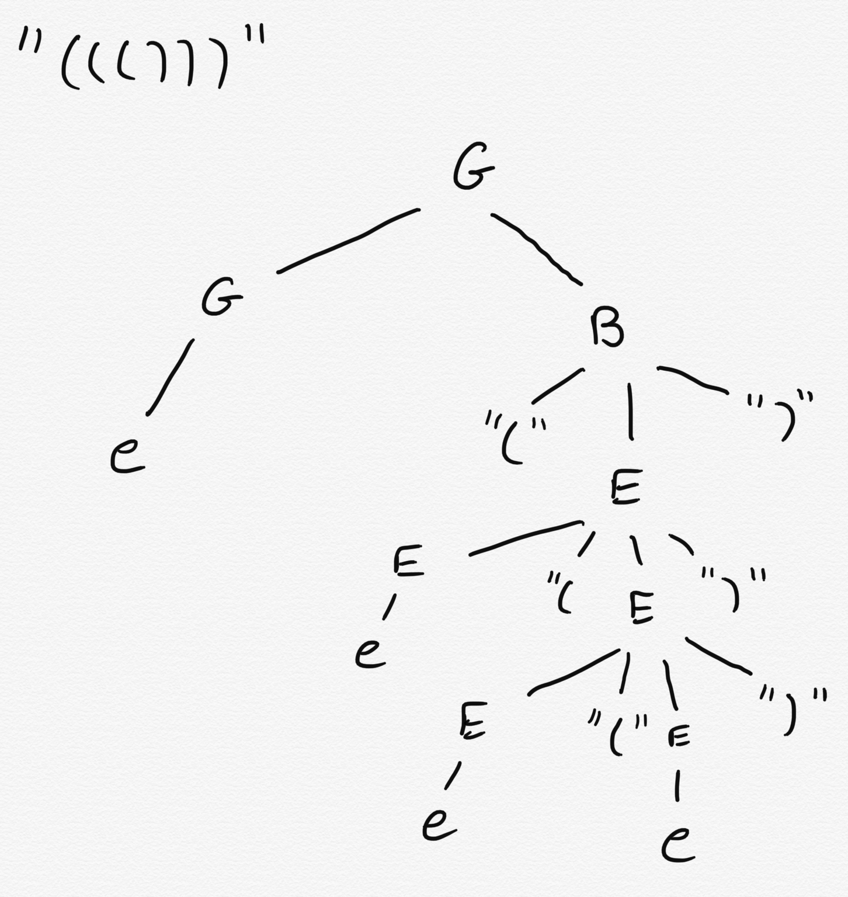

# CSE 262 - Programming Languages - Homework 4

**Due Date: 9/22/2020 by EOD**

**This assignment is out of 100 points. All questions are weighted equally.**

## Instructions

1. Fork this repository into your CSE262 project namespace. [Instructions](https://docs.gitlab.com/ee/workflow/forking_workflow.html#creating-a-fork)
2. Clone your newly forked repository onto your development machine. [Instructions](https://docs.gitlab.com/ee/gitlab-basics/start-using-git.html#clone-a-repository) 
3. As you are writing code you should commit patches along the way. *i.e.* don't just submit all your code in one big commit when you're all done. Commit your progress as you work. **You should have at least one commit per question. We will start taking off points from now on for not following this rule.**
4. When you've committed all of your work, there's nothing left to do to submit the assignment.

For this assignment you are to answer the following questions regarding grammars and parsers. This isn't a programming assignment *per se*, but you might want to experiment with some Rust code to answer some of the questions.

Write answers to all of the questions in this README file. For parse trees, you may draw these by hand and scan them, draw them in powerpoint and make a picture, or make little ASCII trees (probably the easiest). For example:

```
Root
├ Parent1
│ ├ Child1
│ ├ Child2
│ │ └ GrandChild
│ └ Child3
└ Parent2
```
Whatever you do, make sure that you display these in your README. If it's a picture, embed it in the README with Markdown or HTML. e.g.

```html

```

## Questions

### Part 1 - Writing Grammars

Write a grammar in EBNF notation to capture the described language described. For each question, examples of valid and invalid strings in the language are given. There are more strings that may be valid or invalid, these are just examples. Your grammar must accept/reject these strings and others that meet the described parameters.

#### Question 1 - Strings in Rust. 

Strings begin and end with a quotation mark. Within the quotes are any number of charaters except double quote and backslash. Strings may contain quote or back-slash characters if and only if those are escaped by a preceding backslash.

Valid strings:

```
"hello world"
"abcdefg1234567!@#$%^"
"This is an escaped quote \" and an escaped backslash \\"
```

Invalid strings:

```
"hello
"he said "hello" "
"This \ that"
```

###### Solution:

```
String := '"', String_chars, '"'; 
String_chars := {(? all visible characters ? | ? all whitespace characters ? - '"') - '\' | '\"' | '\\'};
```

#### Question 2 - Comments 

Comments are delimited by `/*` and `*/` or by `//`. Any character except a newline may follow a `//`. Any character can follow a `/*` unless that character is an asterisk `*` followed by a `/`.

Valid comments:

```
// inline comments can have any character including / and *
//this is valid
/* you can do a block like this on one line */
/* you can do a block \n on multiple lines */
```

Invalid comments:

```
/ not valid,
// not a\nvalid comment
/* blocks need to be closed, so this is invalid
/* */ */
```

###### Solution:

```
Comment := inline | block;
inline := '//', inline_chars;
block := '\*', block_chars, '*/';
inline_chars := {(? all visible characters ? | ? all whitespace characters ?) - 'LF'};
block_chars := {block_duos};
block_duos := ((? all visible characters ? | ? all whitespace characters ?), [? all visible characters ? | ? all whitespace characters ?]) - '*/';
```

#### Question 3 - E-mail addresses. 

Use this as a guide for how e-mail addresses are formatted: http://www.huge.org/clapres/cla_4.html

Valid e-mail addresses:

```
hello@world.com
cim310@lehigh.edu
info@bbc.co.uk
```

Invalid addresses:

```
can't have spaces@gmail.com
this.com
name@.com
```

###### Solution:

```
email := name, '@', company, '.', organization, [country];
name := {? all visible characters ?};
company := {l_letter | u_letter};
organization := l_letter, l_letter, [l_letter];
country := '.', l_letter, l_letter;
l_letter := 'a' | 'b' | 'c' | 'd' | 'e' | 'f' | 'g' | 'h' | 'i' | 'j' | 'k' | 'l' | 'm' | 'n' | 'o' | 'p' | 'q' | 'r' | 's' | 't' | 'u' | 'v' | 'w' | 'x' | 'y' | 'z';
u_letter := 'A' | 'B' | 'C' | 'D' | 'E' | 'F' | 'G' | 'H' | 'I' | 'J' | 'K' | 'L' | 'M' | 'N' | 'O' | 'P' | 'Q' | 'R' | 'S' | 'T' | 'U' | 'V' | 'W' | 'X' | 'Y' | 'Z';
```

#### Question 4 - Phone numbers

Use this as a guide for how phone numbers are formatted: https://en.wikipedia.org/wiki/National_conventions_for_writing_telephone_numbers#United_States,_Canada,_and_other_NANP_countries

Valid phone numbers:

```
555-555-5555
123-456-7890
```

Invalid phone numbers:

```
484-023-9378
123-123-1234
5555555555
```

###### Solution:

```
phone_number := area, '-', num, '-', extension;
area := n_digit, digit, digit;
num := n_digit, digit, digit;
extension := digit, digit, digit, digit;
digit := '0' | '1' | '2' | '3' | '4' | '5' | '6' | '7' | '8' | '9';
n_digit := ((digit - '0') - '1');
```

#### Question 5 - Numeric constants 

These are binary, octal, decimal, hexadecimal, scientific.

- Binary numbers are prefixed with `0b` and contain the digits `0` and `1`. e.g. `0b01010110`
- Octal numbers are prefixed with `0o` and contain the digits `0` through `7`. e.g. `0o12345670`
- Decimal numbers have no prefix and contain the digits `0` through `9`. An optional period can be inserted to indicate a floating point constant. They can optionally be negative indicated by a preceding - sign. e.g. `1234567890` or `12345.67890`
- Hexadecimal number are prefixed with `0x` and contain the digits `0-9`, and the letters `A-F`. e.g. `0x1234567ABCDEF`
- Decimal constants can be written in scientific notation of the form: AeN (A times ten raised to the power of N), where the exponent N is an integer, and the coefficient A is any real number. The integer N is called the order of magnitude and the real number A is called the mantissa. e.g. `42.3e5` 

Optional underscores can be inserted into the middle of a number to improve readability. e.g. `1_000_000`

Valid numeric constants:

```
0b1010101
0o1643
0o1010101
456
4.56e2
3.14159
0xFFAA19
1_000
-123.456
-123
```

Invalid numbers:

```
0b123
0xABCDEFG
FFAA12
0o3.1415
_1000
0000000123
-0b10101
```

###### Solution:

```
number := binary | octal | decimal | hexadecimal | scientific;
binary := '0b', {'0' | '1' | '_'};
octal := '0o', {(digit - '9') - '8' | '_'};
decimal := (['-'], (digit - '0'), [{digit | '_'}], ['.', digit], [{digit | '_'}]) | {'0'};
hexadecimal := '0x', {digit | letter | '_'};
scientific := decimal, 'e', ['-'], digit;
digit := '0' | '1' | '2' | '3' | '4' | '5' | '6' | '7' | '8' | '9';
letter := 'A' | 'B' | 'C' | 'D' | 'E' | 'F';
```

## Part 2 - Parse Trees

### Question 6

Consider the following grammar:

`e` stands for the string terminating character.

```ebnf
statement = assignment | subroutine_call;
assignment = identifier, ":=", expression;
subroutine_call = identifier, "(", argument_list, ")";
expression = primary, expression_tail;
expression_tail = operator, expression | e;
primary = identifier | subroutine_call | "(" , expression , ")";
operator = "+" | "-" | "*" | "/";
argument_list = expression, argument_tail;
argument_tail = "," , argument_list | e;
identifier = {a-z | A-Z | 0-9};
```

1. Construct a parse tree for the input string "print(x)".


2. Construct a parse tree for the input string "y := 1 + add(a,b)".



3. Construct a parse tree for the input string "z := 1 + 2 * 3".


### Question 7

Consider the following context-free grammar:

```ebnf
G = G, B | G, N | e;
B = "(", E, ")";
E = E, "(", E, ")" | e;
N = "(", L, "]";
L = L, E | L, "(" | e;
```

1. Describe in English the language generated by this grammar. What does this langauge does this grammar recognize? Hint: B stands for "balanced", N stands for "non-balanced".

The language that this grammar generates is a language for using grouping characters (e.g. "(", ")", and "]"). The language recognizes both balanced sets of grouping characters (i.e. every opening grouping character has a properly placed closing grouping character), as well as non-balanced sets of grouping characters (i.e. an opening grouping character may not have a closing grouping character and a closing grouping character may not have an opening grouping character).

2. Give a parse tree for the string "((]()".


3. Give a parse tree for the string "((()))".



## Part 3 - Short Answer Questions

### Question 8

Errors in a program can be classified according to when they are detected and, if they are detected at compile-time, what part of the compiler detects them. Give an example in Rust of each of the following compile-time errors:

1. A lexical error, detected by the lexer.

```rust
fn main() {
  let 😃 = 5;
  println!("{}", 😃);
}
```

This will be a lexical error because the lexer for rust does not have a token for the 😃 emoji, so it will be unable to procees because it doesn't know how to tokenize 😃

2. A syntax error, detected by the parser.

```rust
fn main(){
    println!("Hello World"];
}
```

This will be a syntax error because when the parser creates the parse tree, it will expect to find a ")" after the hello world, but instead finds a "]"

3. A static semantic error, detected by semantic analysis.

```rust
fn main() {
  let y = x + 5;
  let x = 4;
}
```

This will be a static semantic error detected by semantic analysis because x is not valid at the time that it is used because it is declared later, however, this would likely not be caught by the parser because it is valid in EBNF and therefore would be caught after during semantic analysis.

4. A ownership error, detected by the borrow checker.

```rust
fn main() {
  let x = String::from("Hola");
  let y = x;
  println!("{}", x)
}
```

This is an ownership error because the ownership of the string on the heap is transferred from x to y, and therefore x is no longer valid to print.

5. A lifetime error, detected through lifetime analysis of variables.

```rust
fn main() {
  let x;
  {
    let mut y = Vec::new();
    y.push(5);
    x = &y;
  }
  println!("{:?}", x);
}
```

This is a lifetime error because the vector that y points to goes out of scope and gets cleared from memory, but x does not go out of scope and x has a reference to what would now be nonexistent memory.

### Question 9

In Rust, what is the limit on the value of a usize? What happens in the event of arithmetic overflow? Don't look this up, figure it out on your own and write the code you used below. What are the implications of size limits on the portability of programs from one machine/compiler to another?

The limit on the value of a usize is 18446744073709551615. In the event of an arithmetic overflow, the compiler crashes and an error is given. I used this code to determine this: 
```rust
fn main() {
  let x: usize = 9000000000000000000000;
  println!("{}", x);
}
```
I set x to be an obscenely large number and then attempted to print it in case numbers started counting backwards (like they do in java) or doing something else, but instead, I recieved the compiler error below which told me the maximum value of a usize (which occurred during the compile not the running of main):
```bash
error: literal out of range for `usize`
 --> main.rs:2:20
  |
2 |     let x: usize = 9000000000000000000000;
  |                    ^^^^^^^^^^^^^^^^^^^^^^
  |
  = note: `#[deny(overflowing_literals)]` on by default
  = note: the literal `9000000000000000000000` does not fit into the type `usize` whose range is `0..=18446744073709551615`    

error: aborting due to previous error
```
The implications of size limits are that it actually makes a program more portable because by limiting the size of the number, it is limiting the number of bytes that are used to store the number, meaning that computers and compilers allocated less memory (or smaller pointers on the heap) will have a greater chance of being able to compile/run the program.

### Question 10

Why is it difficult to tell whether a program is correct or not? How do you personally go about finding bugs in your code? What kinds of bugs are revealed by testing? What kind of bugs cannot be caught by testing?

It is difficult to tell if a program is correct or not because there are many steps that the lexer and parser must go through in order to make sure that the program is valid within the language. After this, even if the program is valid, it may not do what the user would like it to do. These issues can be difficult to track down because there may not be anything "wrong" with the program except for it producing an incorrect result. The way that I personally go about finding bugs in my code is either by using print statements for debugging purposes or using a debugger such as gdb and running through each line of code individually in order to find issues. Bugs that can be revealed by testing are generally things such as runtime errors in particular cases as well as bugs causing incorrect output. Other bugs that generally cannot be caught during testing would be things like memory leaks and other bugs that don't generally affect the correctness of the program, but can end up causing issues later.
