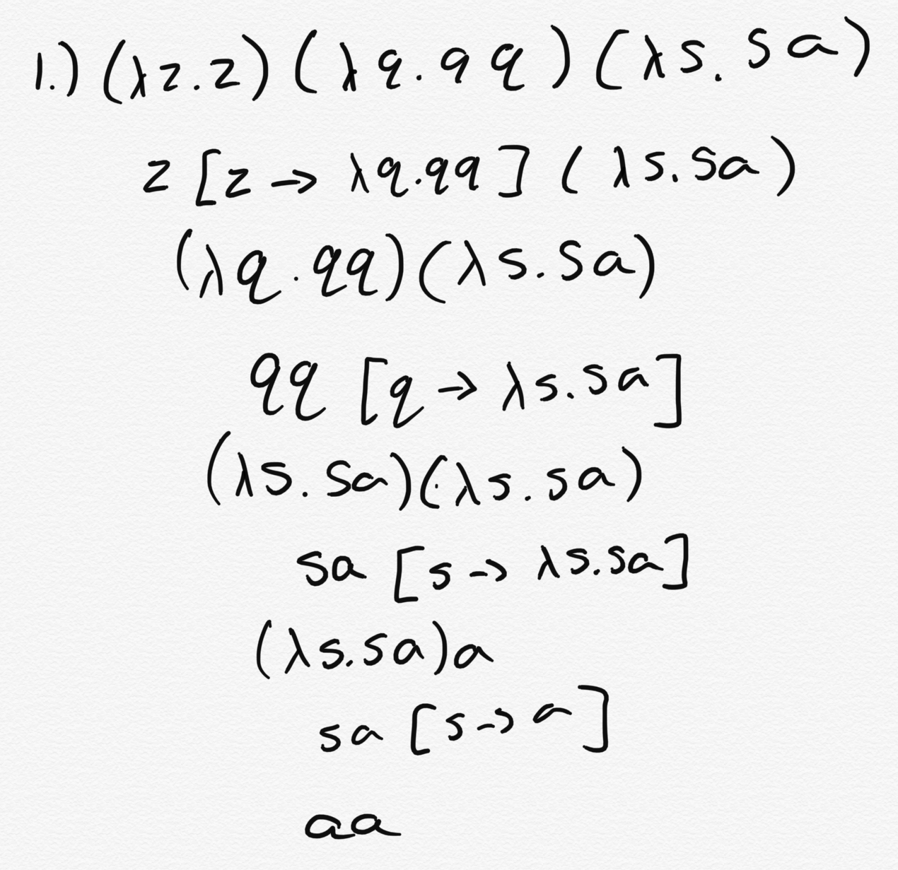
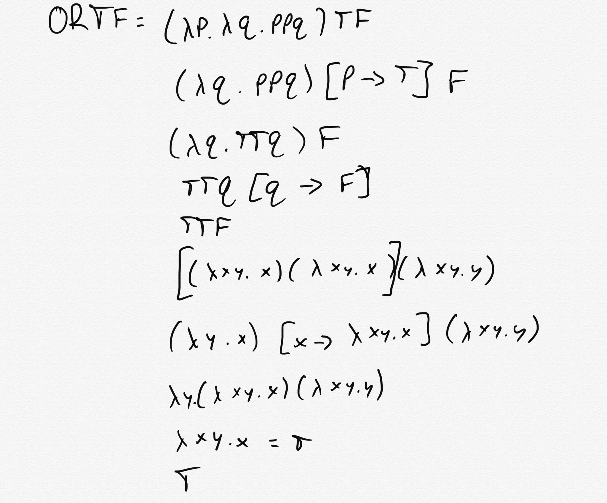

# CSE262 - Programming Languages - Homework 6

**Due Date: 10/14/2020 by EOD**

**This assignment is out of 100 points. All questions are weighted equally.**

## Instructions

1. Fork this repository into your CSE262 project namespace. [Instructions](https://docs.gitlab.com/ee/workflow/forking_workflow.html#creating-a-fork)
2. Clone your newly forked repository onto your development machine. [Instructions](https://docs.gitlab.com/ee/gitlab-basics/start-using-git.html#clone-a-repository) 
3. As you are writing code you should commit patches along the way. *i.e.* don't just submit all your code in one big commit when you're all done. Commit your progress as you work. You should have at least one commit per question. **The assignment will not be accepted if you do not follow this procedure.**
4. When you've committed all of your work, there's nothing left to do to submit the assignment.

## Assignment

Solve the following five questions regarding the Lambda Calculus.

## Question 1

Make all parentheses explicit in these λ- expressions:

1. (λp.(pz)) (λq.(w (λw.((wq)z)p)))

2. (λp.((pq) (λp.(qp))))

## Question 2

In the following expressions say which, if any, variables are bound (and to which λ), and which are free.

1. λs.s z λq.s q

All 3 's' values are bound to the first lambda. The 'z' value is a free variable. Both 'q' values are bound to the second lambda.

2. (λs. s z) λq. w λw. w q z s

The first 2 's' values are bound to the first lambda. The third 's' value is a free variable. Both 'z' values are free variables. Both 'q' values are bound to the second lambda. The first 'w' value is a free variable. The second and third 'w' values are bound to the third lambda.

3. (λs.s) (λq.qs)

The first 2 's' values are bound to the first lambda. The first 2 'q' values are bound to the second lambda. The third 's' value is a free variable.

4. λz. (((λs.sq) (λq.qz)) λz. (z z))

The first 2 'z' values are bound to the first lambda. The third, fourth, and fifth 'z' values are bound to the fourth lambda. Both 's' values are bound to the second lambda. The first 'q' value is a free variable. The second and third 'q' values are bound to the third lambda.

## Question 3

Put the following expressions into beta normal form (use β-reduction as far as possible, α-conversion as needed) assuming left-association.

1. (λz.z) (λq.q q) (λs.s a)

2. (λz.z) (λz.z z) (λz.z q)

3. (λs.λq.s q q) (λa.a) b

4. (λs.λq.s q q) (λq.q) q

5. ((λs.s s) (λq.q)) (λq.q)

## Question 4

1. Write the truth table for the `OR` operator below.

2. The Church encoding for OR = (λp.λq.p p q)

Prove that this is a valid `OR` function by showing that its output matches the truth table above. You will have 4 derivations. For the first derivation, show the long-hand solution (don't use T and F, use their definitions). For the other 3 you may use the symbols in place of the definitions. 

Proof OR TT = T

Proof OR TF = T

Proof OR FT = T

Proof OR FF = F

Because each value matches that of the truth table, the church encoding for OR of (λp.λq.p p q) is equivalent to the expression OR.

## Question 5

Derive a lambda expression for the `NOT` operator. Explain how this is similar to an `IF` statement.

This expression where `NOT = (λxy.y)` is similar to an `IF` statement because an `IF` statement would be (λx.x) because `IF T = T` and `IF F = F` is satisfied by this expression and this statement is essentially the evaluation that occurs from the λx function in the `NOT` statement.