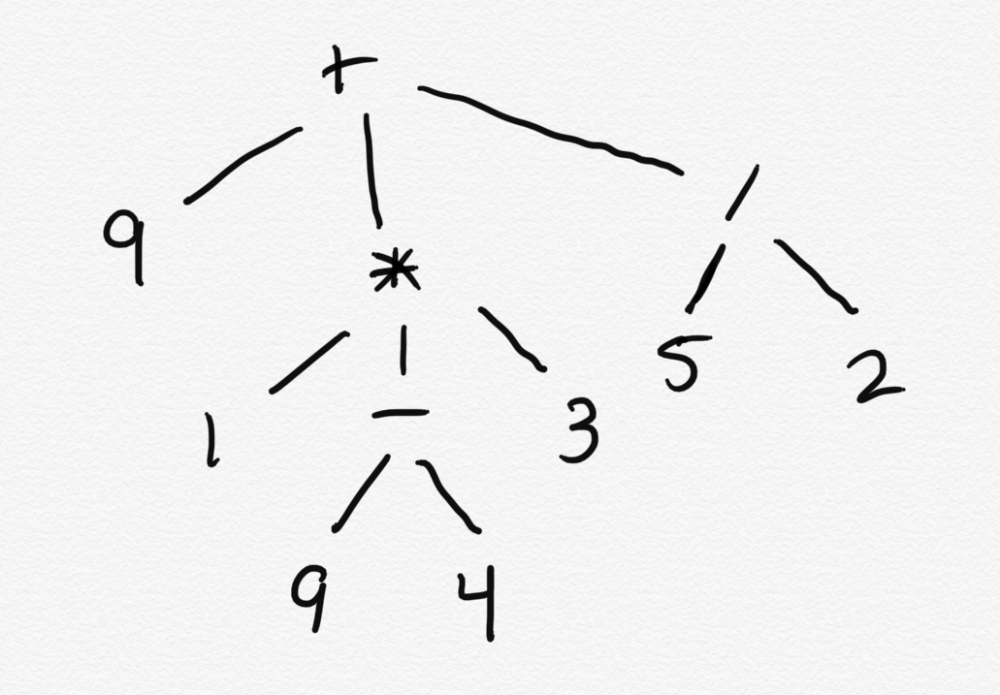

# CSE 262 - Quiz 5

**Due: 9/28/2020 EOD**

Write your answers in this README file in the space below. Make at least one commit per question.

## Question 1

What does it mean for a function to be referentially transparent? List two examples of functions which are referentially transparent (other than the ones given in lecture and the book). List two examples of functions which are *not* referentially transparent (other than the ones given in lecture and the book).

If a function is referentially transparent, it means that the function is pure and produces no side effects. This means that the function's return is entirely dependent upon the input, and for each input, there is only one possible output
One example of a referential function is this:
```rust
fn value(val: f64){
    return val;
}
```
This function returns the value of the float that is passed to it. It relies entirely on the input and no side effects occur.
Another example of a referential function is this function:
```rust
fn sum(val1: f64, val2: f64){
    return val1 + val2;
}
```
This function returns the sum of 2 different values. When input with specific values, the function will return a specific output, because the return is entirely dependent on the inputs. There are also no created side effects.
This class contains method that is not referentially transparent: 
```java
public class Foo{
    int instanceVal = 7;
    public static int Bar(int val){
        instanceVal = 7;
        return val;
    }
}
```
This method is not referentially transparent because it has the side effect of editing the value of the instanceVal variable, which is not part of the local scope.
Another example of a function that is not referentially transparent is this: 
```java
public class Foo{
    public static int Bar(int val){
        Random rand = new Random();
        int random = rand.nextInt(10);
        if(random >= 5){
            return val * -1;
        }
        return val;
    }
}
```
This method is not referentially transparent because even with the same input, the return value could be negative or positive.
## Question 2

What is memoization? List two benefits of memoization.


Memoization is a way of increasing efficiency within an algorithm by saving the result of a function with a specified input in a hash table or array or some other data structure so that instead of reevaluating the function with that input later (if needed), the result of that function can instead be looked up in constant time which is likely faster than the speed of the function. This can be a very useful strategy for writing algorithms more efficiently.

## Question 3

Consider the following expression:

```
(+ 1 2)
```

This represents a tree, where the `+` is the root, and the `1` and `2` are children:

```
+
├ 1
└ 2
```

Write the following expression as a tree:

```
(+ 9 (* 1 (- 9 4) 3) (/ 5 2))
```


What does it evaluate to?

(+ 9 (* 1 (- 9 4) 3) (/ 5 2)) = (9 + (1 * (9 - 4) * 3) + (5 / 2))

= 9 + 15 + 5/2

= 24 + 5/2

= 48/2 + 5/2

= 53/2
